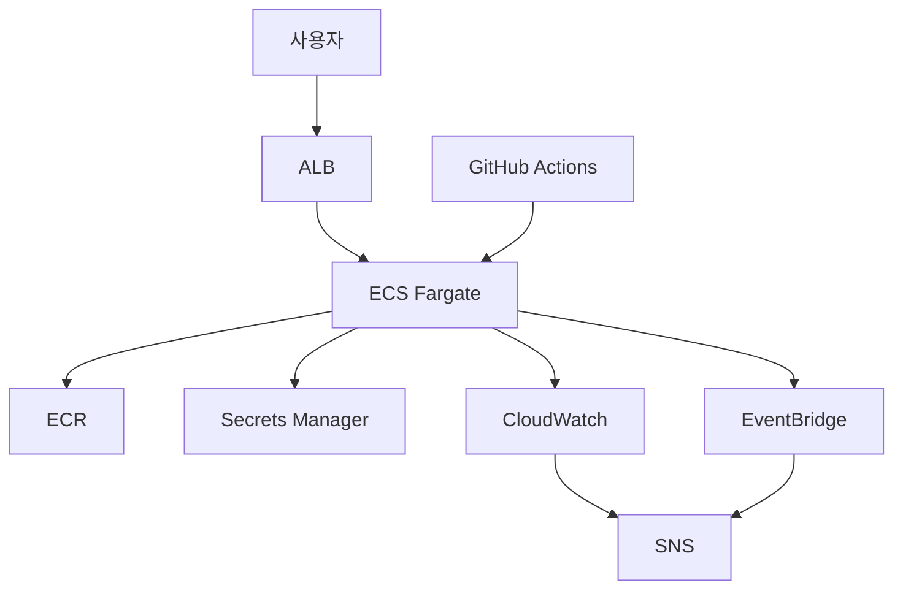

# ECS 운영 및 장애 대응 프로젝트

Terraform으로 ECS Fargate 환경을 구축하고, 서비스 상태 확인과 장애 대응 과정을 실습한 프로젝트입니다.

## 구성도

ECS Task는 Private Subnet에 배치하고, 외부에서는 ALB를 통해서만 접근할 수 있도록 구성했습니다.

## 사용 기술

* AWS ECS Fargate
* Application Load Balancer
* Amazon ECR
* CloudWatch
* SNS
* EventBridge
* Secrets Manager
* Terraform
* GitHub Actions OIDC
* Spring Boot
* Docker

## 주요 구성

* Terraform을 이용한 AWS 인프라 구축
* S3 Remote State와 State Locking 설정
* Private Subnet에 ECS 서비스 배치
* CloudWatch Dashboard와 Alarm 구성
* SNS 이메일 알림 설정
* ECS Deployment Circuit Breaker 설정
* 배포 실패 시 자동 롤백
* GitHub Actions OIDC 자동 배포
* Terraform 코드와 실제 리소스의 차이 확인 및 복구

## 배포 과정

GitHub Actions에서 Access Key를 저장하지 않고 OIDC를 이용해 AWS IAM Role을 사용하도록 설정했습니다.

배포는 다음 순서로 진행됩니다.

1. 애플리케이션 테스트
2. Docker 이미지 빌드
3. ECR에 이미지 Push
4. 새 Task Definition 등록
5. ECS Service 배포
6. 배포 상태 확인

Docker 이미지 태그에는 Git Commit SHA를 사용해 배포된 버전을 확인할 수 있도록 했습니다.

## 모니터링

CloudWatch Dashboard에서 다음 항목을 확인할 수 있도록 구성했습니다.

* 정상 및 비정상 Target 수
* ECS CPU 사용률
* ECS Memory 사용률
* 애플리케이션 로그
* ALB 5xx 응답 수

CloudWatch Alarm과 EventBridge에서 장애를 감지하면 SNS를 통해 이메일 알림을 보내도록 설정했습니다.

## 장애 대응 기록

| 장애              | 증상              | 확인 내용                                    | 복구 방법                     |
| --------------- | --------------- | ---------------------------------------- | ------------------------- |
| Health Check 실패 | Target에서 503 발생 | ECS 이벤트, ALB Target 상태, CloudWatch Alarm | v1으로 자동 롤백                |
| 네트워크 차단         | 외부 요청 타임아웃      | Security Group, ALB Target 상태            | 인바운드 포트를 8080으로 복구        |
| Secret 권한 제거    | 새 Task 실행 실패    | `AccessDeniedException`, ECS 이벤트         | Task Execution Role 권한 복구 |

자세한 내용은 다음 문서에 정리했습니다.

* [Health Check 장애](docs/health-fail.md)
* [네트워크 장애](docs/net-fail.md)
* [IAM 권한 장애](docs/iam-fail.md)

## Terraform 상태 차이 확인

AWS Console에서 ECS Cluster 태그를 직접 변경한 뒤 `terraform plan`을 실행했습니다.

Terraform이 코드에 작성된 설정과 실제 AWS 리소스의 차이를 확인했고, `terraform apply`를 실행해 코드에 작성된 상태로 복구했습니다.

## 결과

* ECS 서비스 정상 실행 확인
* 장애 발생 시 이메일 알림 수신 확인
* 실패한 배포의 자동 롤백 확인
* GitHub Actions를 이용한 자동 배포 확인
* Terraform을 이용한 설정 차이 확인 및 복구
